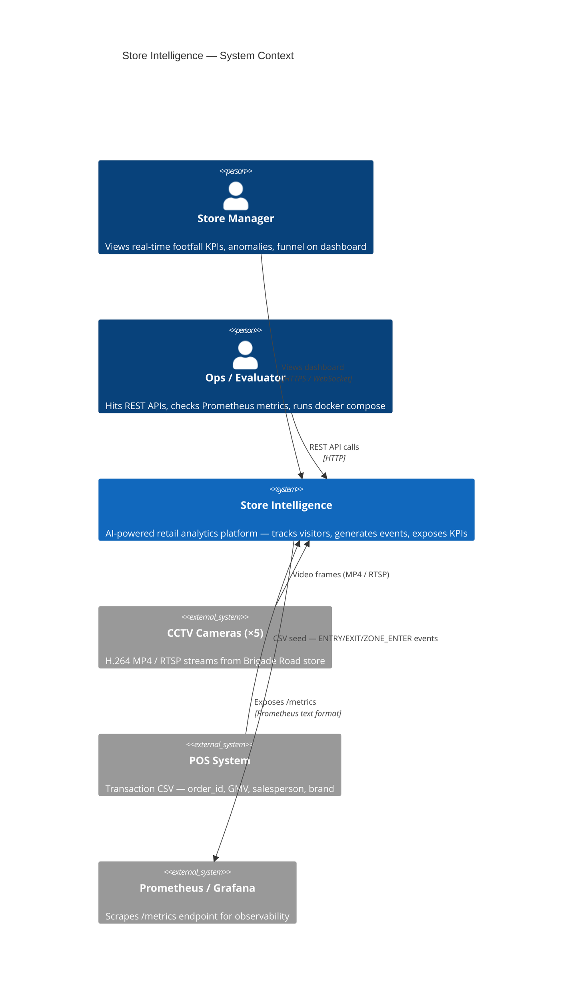
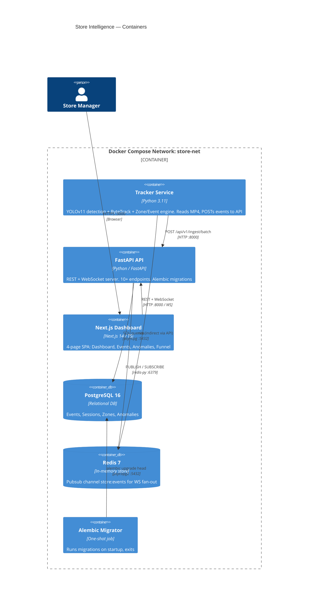
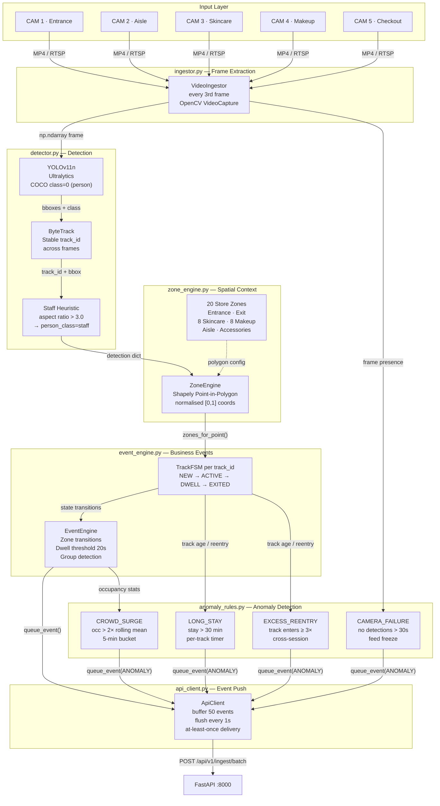
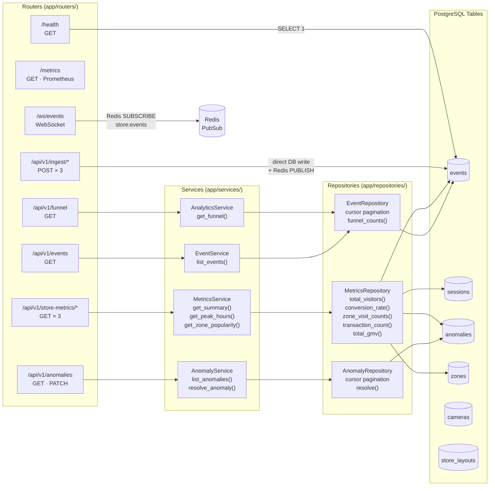
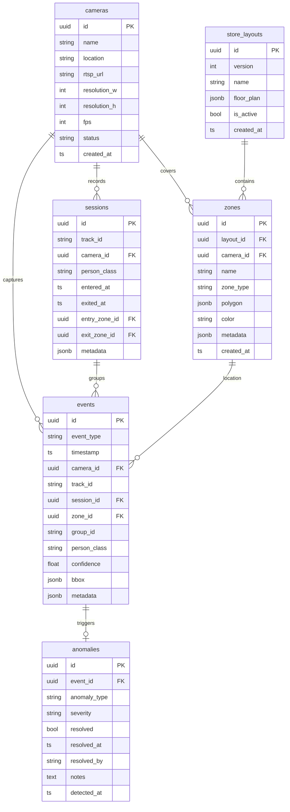
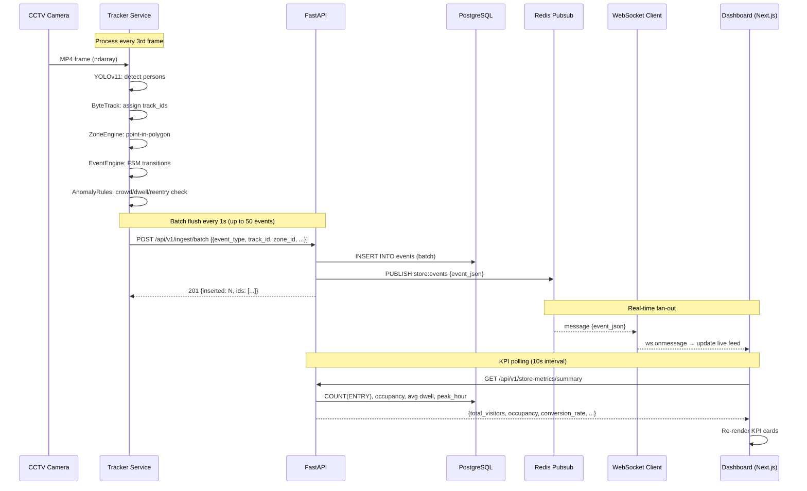
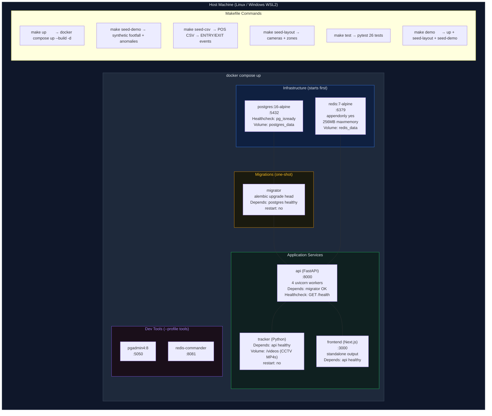
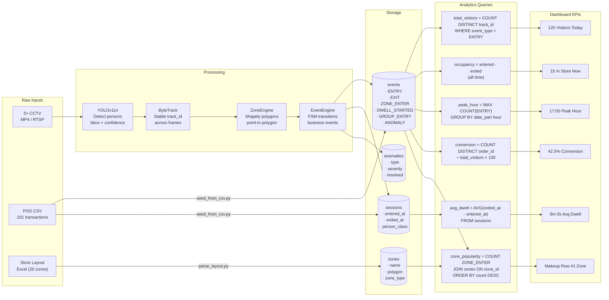
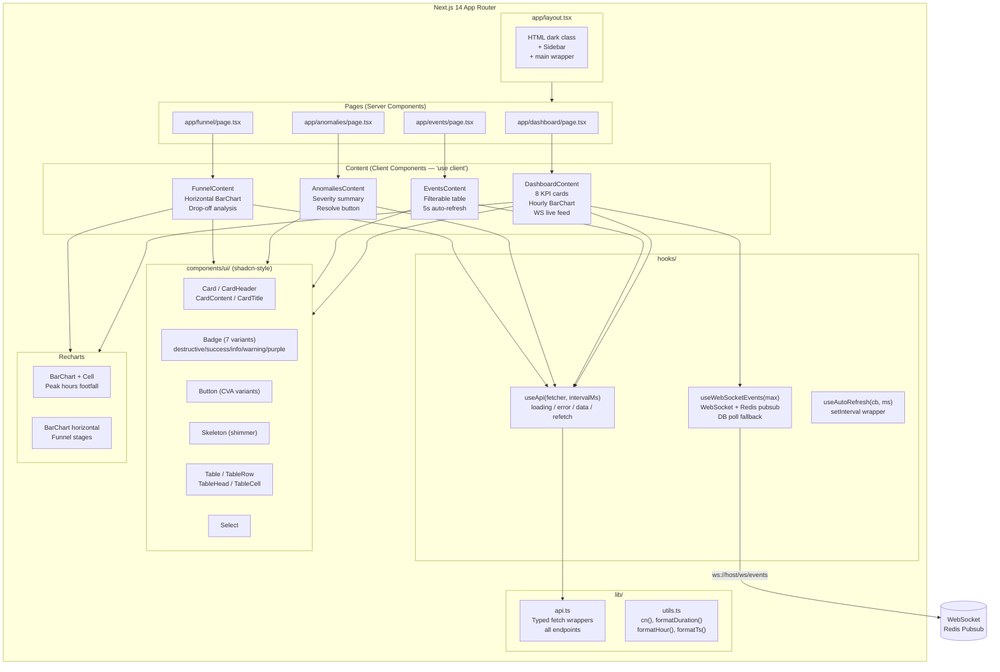
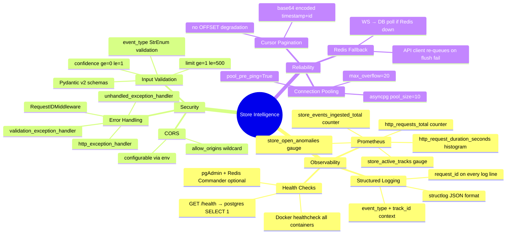

# Store Intelligence — System Design Architecture

> **Render these diagrams:** GitHub, Notion, VS Code (Markdown Preview Mermaid Support), or [mermaid.live](https://mermaid.live)

---

## 1. C4 — Context Diagram



---

## 2. C4 — Container Diagram



---

## 3. Tracker Service — Internal Component Diagram



---

## 4. FastAPI — Router & Service Layer



---

## 5. Database Schema (ERD)



---

## 6. Event Ingestion Sequence



---

## 7. Anomaly Detection Flow

```mermaid
flowchart TD
    START([Every frame processed]) --> CHECK_CROWD

    CHECK_CROWD{Occupancy >\n2× rolling mean?}
    CHECK_CROWD -->|Yes| FIRE_CROWD[Fire CROWD_SURGE\nHIGH severity]
    CHECK_CROWD -->|No| CHECK_DWELL

    CHECK_DWELL{Any track\nage > 30 min?}
    CHECK_DWELL -->|Yes| FIRE_DWELL[Fire LONG_STAY\nMEDIUM severity]
    CHECK_DWELL -->|No| CHECK_REENTRY

    CHECK_REENTRY{Any track\nentries ≥ 3?}
    CHECK_REENTRY -->|Yes| FIRE_REENTRY[Fire EXCESS_REENTRY\nMEDIUM severity]
    CHECK_REENTRY -->|No| CHECK_CAM

    CHECK_CAM{No detections\n> 30 seconds?}
    CHECK_CAM -->|Yes| FIRE_CAM[Fire CAMERA_FAILURE\nHIGH severity]
    CHECK_CAM -->|No| DEDUP

    FIRE_CROWD & FIRE_DWELL & FIRE_REENTRY & FIRE_CAM --> DEDUP

    DEDUP{Key already\nfired this\nwindow?}
    DEDUP -->|Yes| SKIP[Skip — dedup cache hit]
    DEDUP -->|No| QUEUE[queue_event ANOMALY\nto ApiClient buffer]

    QUEUE --> INGEST[POST /api/v1/ingest/batch\nmetadata.anomaly_type]
    INGEST --> PGSTORE[(PostgreSQL\nanomalies table)]
    INGEST --> RESOLVE

    RESOLVE{Manager\nresolves?}
    RESOLVE -->|PATCH /anomalies/id/resolve| CLOSED[resolved=true\nresolved_at=now()]
```

---

## 8. Infrastructure & Deployment



---

## 9. Data Flow — CCTV to Dashboard KPI



---

## 10. Frontend Architecture



---

## 11. Security & Observability



---

## Summary Table

| Layer | Technology | Purpose |
|---|---|---|
| Detection | YOLOv11n (Ultralytics) | Person bounding boxes, COCO class 0 |
| Tracking | ByteTrack (via Ultralytics) | Stable track_id across frames |
| Zone Mapping | Shapely | Point-in-polygon, normalised coords |
| Event Engine | Python FSM | Tracks → ENTRY/EXIT/ZONE/DWELL events |
| Anomaly Engine | Rule-based Python | CROWD_SURGE/LONG_STAY/REENTRY/CAM_FAIL |
| API | FastAPI + asyncpg | 10+ REST + WebSocket endpoints |
| Database | PostgreSQL 16 | Event store, 6 tables, Alembic migrations |
| Cache / Pubsub | Redis 7 | WebSocket fan-out via `store:events` channel |
| Frontend | Next.js 14 + shadcn/ui | 4 pages, WS live feed, 5–10s polling |
| Infra | Docker Compose | 6-container orchestration, one command startup |
| Observability | Prometheus + structlog | Metrics scrape + JSON logs |
| Tests | pytest + pytest-asyncio | 26 tests, mocked deps, no DB required |
